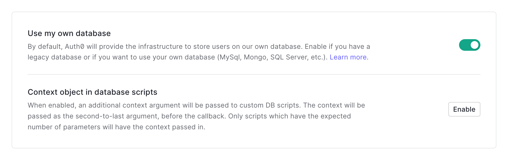

# Auth0 with MongoDB

This is a _development_ configuration with a MongoDB database

## Auth0 configuration

On the _Settings_ tab ensure _Import Users to Auth0_ is disabled

On the _Custom Database_ tab ensure _Use my own database_ is enabled

And (at the bottom of the page) that you have the configuration keys and values

