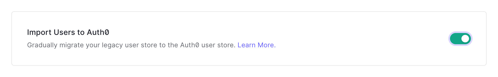
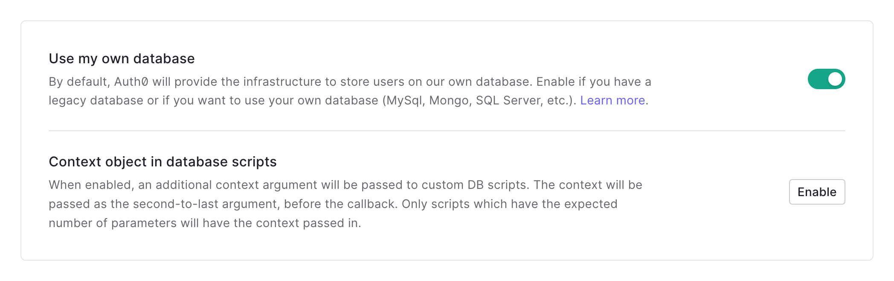
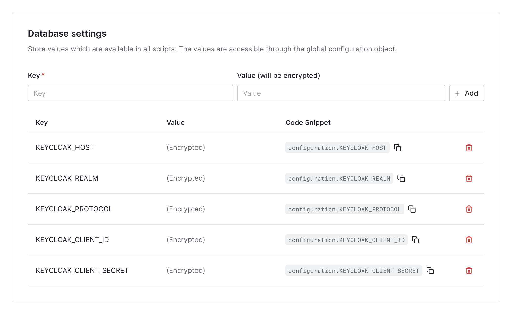

# Auth0

This is a _staging_ or _production_ configuration with an Auth0 database

## Auth0

On the _Settings_ tab ensure _Import Users to Auth0_ is enabled

On the _Custom Database_ tab ensure _Use my own database_ is enabled

And (at the bottom of the page) that you have the configuration keys and values

