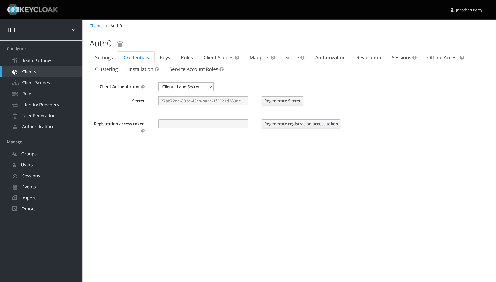

# Keycloak `v15`

### Client

#### Settings

The client ID is configurable on the _Settings_ tab

#### Credentials

The client secret is available on the _Credentials_ tab. (The pictured secret is not valid)

